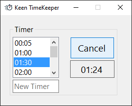
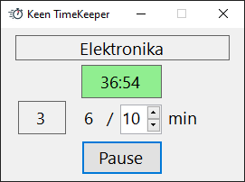

# KeenTimeKeeper

## Timer

## Time on Task

## TODO
- [x] Revert menu with options to context menu that opens on right click on the sides of FrmMain.
- [ ] StartTimerClicked for (some) mode controls:
	- [ ] Make it work for CtrlTimerOnTask and CtrlTimer.
	- [ ] If the value is other then Never, restore FrmMain window after timer is stopped.
- [x] Total time does not look good when minutes are greater than 99. It should be displayed in hours then and the control should be wider.
- [ ] Maybe chunk time should be saved in settings for each task separately.
- [ ] CtrlTimerOnTask shoud have an option for automatic click on Start/Resume button.