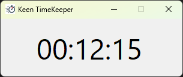

# KeenTimeKeeper
Windows desktop application for time tracking with progress shown in the taskbar.

## Features
- Modes: Track time spent on different tasks, timer and clock (current time).
- Lightweight and easy to use.
- Taskbar integration: See your progress directly in the taskbar icon.

## Timer

## Time on Task

## Clock - Current Time

## TODO
- [ ] (WIP) Add top panel (CtrlRibbon): appear/disappear, buttons/options, functionality, [battery info]
- [ ] Add Installer
- [ ] CtrlTimerOnTask could have an option for automatic click on Start/Resume button.
