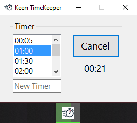
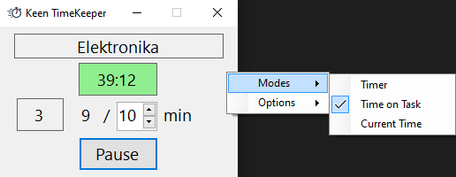

# KeenTimeKeeper

## Timer

## Time on Task
_

## TODO
- [x] Add/Modify task on OK in FrmTextInput
- [x] Add MinimizeOnStartTimeExtensions with ToDisplayString for user-friendly enum display in menu.
- [x] Update UI to display task name with time in task selection ComboBox (FrmTextInput).
- [ ] CtrlTimerOnTask should have an option for automatic click on Start/Resume button.
